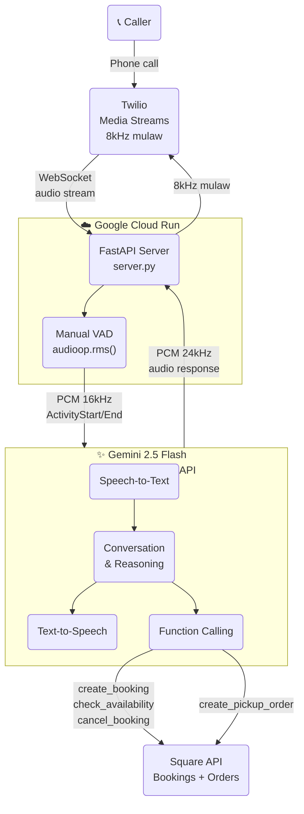

# 🍗 VoiceTable

> **Your restaurant's AI phone staff — answers every call, takes every order.**

VoiceTable is a real-time AI voice agent that handles restaurant phone calls end-to-end: pickup orders, table reservations, menu questions, and more. Powered by Gemini 2.5 Flash Native Audio Live API.

**Try it:** Call the Bonchon demo line and speak naturally. No app, no typing.

---

## Architecture



---

## Features

- 📅 **Table reservations** — checks availability, books, and cancels via Square in real time
- 🛍️ **Pickup orders** — takes full orders with sizes, sauces, and special requests via Square Orders API
- ❓ **Menu questions** — prices, ingredients, allergens, hours
- 🌍 **Multilingual** — auto-detects and mirrors the caller's language (English, Mandarin, Cantonese, Spanish, and more)
- 🔄 **Auto-reconnect** — recovers silently if the Gemini session drops mid-call
- 📱 **Caller ID** — uses the caller's phone number as default contact, no need to repeat it

---

## Tech Stack

| Layer | Technology |
|---|---|
| AI (STT + LLM + TTS) | Gemini 2.5 Flash Native Audio — Live API |
| Phone | Twilio Media Streams |
| POS / Bookings | Square Bookings API + Orders API |
| Backend | Python, FastAPI |
| Cloud | Google Cloud Run |
| CI/CD | GitHub Actions |

---

## How It Works

1. A caller dials the Twilio phone number
2. Twilio streams raw mulaw 8kHz audio to our FastAPI WebSocket server on Cloud Run
3. The server converts audio to PCM 16kHz and forwards it to **Gemini Live API**
4. Gemini handles everything in one bidirectional stream: speech recognition → conversation → function calling → speech synthesis
5. When Gemini calls a function (e.g. `create_booking`), the server executes it against Square API and returns the result
6. Gemini's audio response is converted back to mulaw 8kHz and streamed to the caller via Twilio

### Manual VAD

Gemini's built-in voice activity detection doesn't reliably detect 8kHz phone audio upsampled to 16kHz. We disabled it and implemented our own using `audioop.rms()` with explicit `ActivityStart` / `ActivityEnd` signals.

```
RMS > 300  →  ActivityStart + stream audio
Silence > 0.65s  →  ActivityEnd
```

---

## Setup

### Prerequisites

- Python 3.11+
- Twilio account with a phone number
- Google AI API key (Gemini)
- Square developer account (production)

### Local Development

```bash
git clone https://github.com/ejzhu2025/voice-booking-agent
cd voice-booking-agent
pip install -r requirements.txt

cp .env.example .env
# Fill in your API keys in .env

python server.py
# Server runs on http://localhost:8000

# In another terminal:
ngrok http 8000
# Set Twilio webhook → https://<ngrok-url>/incoming-call
```

### Environment Variables

```env
GOOGLE_API_KEY=...
SQUARE_ACCESS_TOKEN=...
SQUARE_LOCATION_ID=...
SQUARE_ENVIRONMENT=production
TWILIO_ACCOUNT_SID=...
TWILIO_AUTH_TOKEN=...
TWILIO_PHONE_NUMBER=...
```

---

## Deployment

Pushes to `main` automatically deploy to Google Cloud Run via GitHub Actions.

```bash
gcloud run deploy voice-booking-agent \
  --source . \
  --region us-central1 \
  --project bonchon-voice-agent
```

---

## API Endpoints

| Method | Path | Description |
|---|---|---|
| `POST` | `/incoming-call` | Twilio webhook — starts a phone call session |
| `WS` | `/media-stream` | Bidirectional audio bridge (Twilio ↔ Gemini Live) |
| `POST` | `/demo/chat` | Text-based demo (no phone needed) |
| `GET` | `/health` | Health check |

### Text Demo

```bash
curl -X POST https://voice-booking-agent-983680558370.us-central1.run.app/demo/chat \
  -H "Content-Type: application/json" \
  -d '{"message": "I want to book a table for 2 tonight at 7pm"}'
```

---

## Built for

[Gemini Live Agent Challenge](https://geminiagentchallenge.devpost.com/) — March 2026
